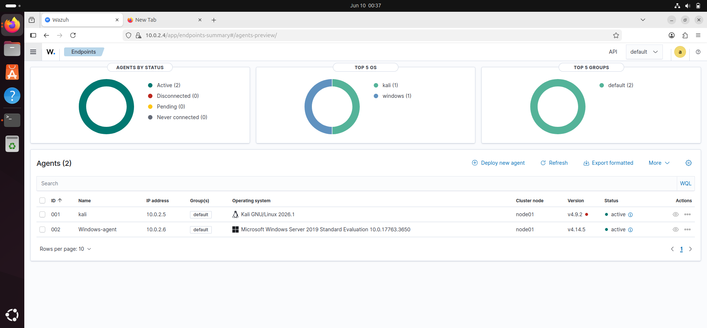
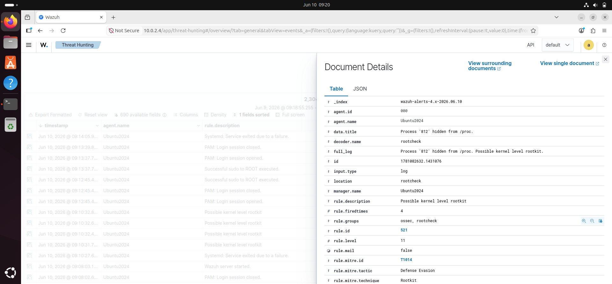

# Wazuh SIEM SOC Monitoring Lab (VirtualBox)

## Project Overview
This project demonstrates a complete SOC environment using Wazuh SIEM to monitor Windows and Linux endpoints, detect security events, and simulate attacker behavior using Kali Linux.


## Objectives

* Deploy a centralized SIEM using Wazuh
* Monitor Windows and Linux endpoints
* Generate security events using Kali Linux
* Analyze alerts and logs within the Wazuh dashboard
* Simulated real-world SOC monitoring, log analysis, and intrusion detection scenarios

## Lab Architecture

### Virtual Machines

| System       | Role                                    |
| ------------ | --------------------------------------- |
| Ubuntu 24.04 | Wazuh Manager, Indexer, Dashboard       |
| Windows Server 2019     | Monitored Endpoint (Wazuh Agent)        |
| Kali Linux   | Attacker Machine and Monitored Endpoint |


### Network Configuration

* VirtualBox NAT Network
* All VMs connected to the same virtual network
* Wazuh Manager IP: 10.0.2.4

## Wazuh Installation

### Ubuntu Server

Downloaded and executed the Wazuh installation assistant:

```bash
curl -sO https://packages.wazuh.com/4.14/wazuh-install.sh
sudo bash ./wazuh-install.sh -a
```

### Challenges Encountered

* Existing Wazuh agent conflicted with manager installation
* Broken package removal scripts
* Wazuh manager startup timeout
* API connection issues
* VirtualBox network configuration troubleshooting

### Resolutions

* Removed existing Wazuh agent
* Repaired package database using dpkg and apt
* Increased VM memory from 4 GB to 6 GB
* Restarted Wazuh services
* Simplified networking by using a single NAT Network adapter

## Agent Deployment

### Kali Linux Agent

Installed and connected successfully to the Wazuh Manager.

Status: Active

### Windows Agent

Installed using the Wazuh MSI package.

Manager IP:

```text
10.0.2.4
```

Service:

```powershell
Start-Service WazuhSvc
```

Status: Active

## Results

Successfully deployed:

* Wazuh Manager
* Wazuh Indexer
* Wazuh Dashboard
* Kali Agent
* Windows Agent

All agents connected and reporting successfully.

## Skills Demonstrated

* SIEM Deployment
* Security Monitoring
* Linux Administration
* Windows Endpoint Monitoring
* VirtualBox Networking
* Wazuh Agent Management
* Troubleshooting and Incident Resolution
* SOC Lab Design

## Future Enhancements

* Sysmon integration
* Suricata integration
* Nmap detection use cases
* Brute-force attack detection
* Custom Wazuh rules
* Threat hunting exercises

### Wazuh Dashboard - Active Agents


This shows successful connection of Windows and Kali agents to the Wazuh SIEM.


* Wazuh Dashboard
* Agent Summary
* Active Agents
* Security Events
* Lab Architecture Diagram

 ## Detection Scenarios Simulated

- Port scanning (Kali → Windows)
- Authentication failures (Windows)
- Endpoint log monitoring (Kali & Windows)
- Security event correlation in Wazuh SIEM

- ## SOC Attack Simulation: Hidden Process Detection

## Objective

This project demonstrates how hidden processes and rootkit-like behavior can be detected using Wazuh rootcheck monitoring on a Linux endpoint.

The goal is to simulate stealth techniques and observe how a SIEM detects anomalous activity.

---


## Lab Environment

- Ubuntu Linux (Wazuh Agent installed)
- Wazuh Manager (SIEM Dashboard)
- Kali Linux (optional attacker VM)

---

## Step 1: System Preparation (Ubuntu Endpoint)

Switch to root and update system packages:

```bash

sudo -i

apt update

```

## Detection Results — June 10, 2026

### Alert Triggered
After loading Diamorphine and hiding rsyslogd (PID 812),
Wazuh rootcheck detected the hidden process within minutes.

### Alert Details
- **Rule ID:** 521
- **Rule Level:** 11 (High Severity)
- **MITRE ATT&CK:** T1014 — Rootkit
- **Tactic:** Defense Evasion
- **Detection Message:** Process '812' hidden from /proc. 
  Possible kernel level rootkit.
- **Fired Times:** 4

### How Wazuh Detected It
Wazuh rootcheck independently scans /proc and compares 
what the kernel reports against actual running processes.
A mismatch between the two = hidden process = rootkit alert.

### Key Takeaway
Kernel rootkits hide from the OS itself but cannot hide 
from a SIEM doing independent out-of-band verification.
This is why endpoint monitoring is critical — the OS 
cannot be trusted when compromised at kernel level.

### Wazuh Dashboard - Active Agents


### Rootkit Detection Alert


### Kernel Rootkit Logs


## Suricata IDS Integration with Wazuh SIEM

### Why I Installed Suricata

Wazuh alone monitors host-level activity — log files, 
processes, file changes. But it cannot see raw network 
traffic. A threat actor scanning my network, probing 
ports, or sending malicious packets would be invisible 
to Wazuh alone.

Suricata fills that gap. It sits on the network interface 
and inspects every packet entering and leaving the machine. 
Together, Wazuh and Suricata give full visibility:
- Suricata watches the network layer
- Wazuh watches the host layer

No blind spots.

---

### Installation & Rules

Installed Suricata 7.0.3 on Ubuntu (Wazuh Manager host).

Used suricata-update to manage the Emerging Threats 
Open ruleset — 50,571 rules covering known attack 
patterns, malware signatures, and suspicious behaviour.

Key configuration:
- HOME_NET: 10.0.2.4 (Ubuntu — the protected asset)
- EXTERNAL_NET: any (everything else, including Kali)
- Interface: enp0s3
- Alert log: /var/log/suricata/eve.json

Wazuh reads eve.json in real time — every Suricata 
alert immediately appears in the Wazuh dashboard.

---

### Attack Simulation — Nmap Port Scan

**What I did:**
From Kali Linux (10.0.2.15) I ran an Nmap SYN scan 
against Ubuntu (10.0.2.4):

```bash
sudo nmap -sS 10.0.2.4
```

**What Suricata detected:**
- ET SCAN Suspicious inbound to MySQL port 3306
- ET SCAN Suspicious inbound to MSSQL port 1433
- ET SCAN Suspicious inbound to PostgreSQL port 5432
- ET SCAN Suspicious inbound to Oracle SQL port 1521
- ET SCAN Potential VNC Scan 5800-5820

**Why this is an IOC (Indicator of Compromise)**

Database ports (3306, 1433, 5432, 1521) should never 
be accessible from external or untrusted sources. In a 
production environment, only the application server 
communicates with the database — never an end user 
or external machine.

An external source scanning these ports signals:
- Active reconnaissance by a threat actor
- Searching for exposed databases with weak credentials
- Preparation for data exfiltration or ransomware

This is the Intelligence Gathering phase of PTES — 
the attacker is mapping the target before striking.

A SOC analyst seeing these alerts should:
1. Identify the source IP (10.0.2.15 — Kali)
2. Check if that IP has made other suspicious connections
3. Determine if any database ports are actually open
4. Block the source IP at the firewall immediately
5. Escalate if the IP is external/unknown

---

### What I Learned

- Suricata detects network-level threats Wazuh cannot see
- eve.json is Suricata's structured alert log — Wazuh 
  reads it natively
- Database port scanning is a high-confidence IOC — 
  legitimate users never touch those ports directly
- The Suricata + Wazuh combination creates a complete 
  detection pipeline from network to host

---

### Screenshots


## VirusTotal Active Response Integration

### Why I Built This

Wazuh alerts are useful but they require a human to 
respond. In a real SOC, analysts are overwhelmed with 
alerts. Automating responses to confirmed threats 
reduces response time from minutes to milliseconds.

This project adds automated threat removal to my lab — 
the first step toward a full SOAR implementation.

### How It Works

1. A file is dropped on the monitored Ubuntu endpoint
2. Wazuh syscheck (realtime) detects it immediately
3. Wazuh sends the file hash to VirusTotal API
4. VirusTotal checks against its security vendors
5. If malicious — active response script deletes it
6. Alert fires in dashboard confirming deletion

### Test — EICAR File

Used the industry-standard EICAR test file to verify 
the pipeline. EICAR is a harmless file that every 
antivirus engine recognises as a test threat.

**Result:**
- 65/68 VirusTotal engines flagged it malicious
- File path detected: /root/eicar.com
- Wazuh fired: "VirusTotal Alert - 65 engines detected"
- Active response deleted the file automatically
- "File deleted" confirmation appeared in dashboard

### What This Demonstrates
- File Integrity Monitoring (FIM) with realtime detection
- Threat intelligence enrichment via VirusTotal API
- Automated active response (basic SOAR behaviour)
- Complete detection-to-response pipeline

### MITRE ATT&CK
- T1204 — User Execution (malicious file)
- Response: Automated deletion via active response

### Screenshots


