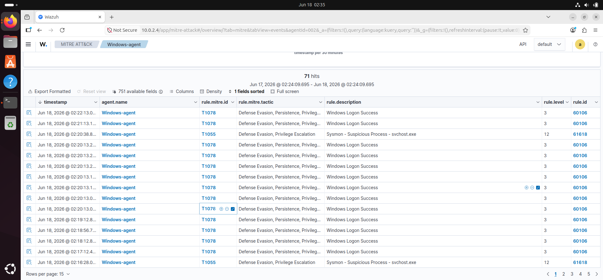
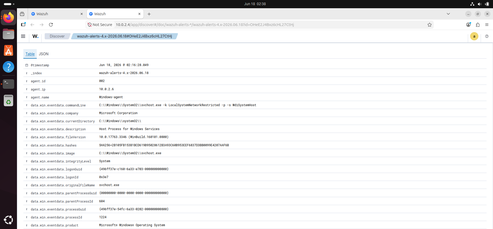
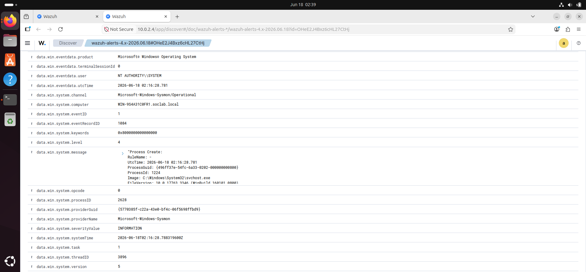
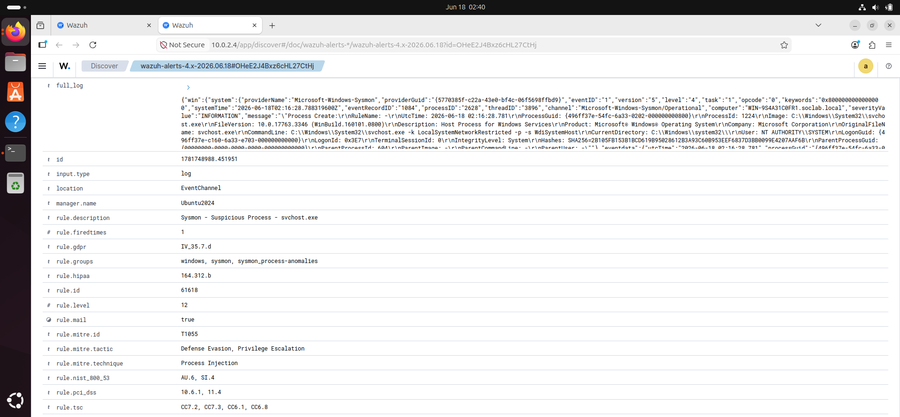

# SOC Lab Daily Log — June 18, 2026

## Date
June 18, 2026

## Objective
To install and configure Sysmon on Windows Server 2019 Domain 
Controller and integrate with Wazuh SIEM for enhanced 
endpoint visibility and threat detection.

## Tools Used
- **Windows Server 2019** — Domain Controller (soclab.local)
- **Sysmon** — Microsoft Sysinternals process monitoring
- **Wazuh Manager** — Ubuntu 10.0.2.4
- **Wazuh Agent** — Windows Server (Windows-agent)
- **Wazuh Dashboard** — Threat hunting and alert analysis

## Activities Performed
- Downloaded and installed Sysmon64 on Windows Server
- Configured Wazuh agent ossec.conf to collect 
  Microsoft-Windows-Sysmon/Operational event channel
- Restarted Wazuh services (indexer → manager → dashboard)
- Verified Sysmon events flowing into Wazuh dashboard
- Investigated suspicious svchost.exe alert (Rule 61618)

## Commands Used

### Windows Server (PowerShell)
```powershell
# Download Sysmon
Invoke-WebRequest -Uri "https://download.sysinternals.com/files/Sysmon.zip" -OutFile "C:\Sysmon.zip"

# Extract
Expand-Archive -Path "C:\Sysmon.zip" -DestinationPath "C:\Sysmon"

# Install
cd C:\Sysmon
.\Sysmon64.exe -accepteula -i

# Verify running
Get-Service Sysmon64

# Restart Wazuh agent after config change
Restart-Service WazuhSvc
```

### Ubuntu (Wazuh Manager)
```bash
sudo systemctl restart wazuh-indexer
sudo systemctl restart wazuh-manager
sudo systemctl restart wazuh-dashboard
```

### Wazuh ossec.conf addition (Windows Server)
```xml
<localfile>
  <location>Microsoft-Windows-Sysmon/Operational</location>
  <log_format>eventchannel</log_format>
</localfile>
```

## Findings

### Alert 1 — Sysmon Suspicious Process svchost.exe
- **Rule ID:** 61618
- **Level:** 12 (High)
- **MITRE:** T1055 — Process Injection
- **Tactic:** Defense Evasion, Privilege Escalation
- **Status:** Under investigation — checking parent process

### Alert 2 — Windows Logon Success
- **Rule ID:** 60106
- **Level:** 3
- **MITRE:** T1078 — Valid Accounts
- **Assessment:** Normal background Windows authentication
- **Volume:** Multiple events per minute — expected on DC

## Challenges
- Bidirectional clipboard not working initially between 
  host PC and Windows Server VM
- Fixed by restarting VBoxService inside Windows Server:
  net stop VBoxService / net start VBoxService

## Lessons Learned
- Sysmon dramatically enhances Windows visibility beyond 
  default event logging — captures process creation with 
  full command line, network connections, file creation, 
  DLL loading, and registry modifications
- svchost.exe is a common masquerading target — Sysmon 
  rule 61618 fires when it runs from non-standard paths
- This is why its best to always restart Wazuh services in order: indexer first, 
  then manager, then dashboard — wrong order causes 
  API connection failures


## Findings & Alert Investigation

### Alert 1 — Sysmon Suspicious Process svchost.exe (Rule 61618)
**Severity:** Level 12 — High
**MITRE:** T1055 — Process Injection
**Tactic:** Defense Evasion, Privilege Escalation

#### Raw Evidence Collected
| Field | Value |
|---|---|
| Image | C:\Windows\System32\svchost.exe |
| Command Line | -k LocalSystemNetworkRestricted -p -s WdiSystemHost |
| User | NT AUTHORITY\SYSTEM |
| Parent Image | NULL (no parent recorded) |
| Hash (SHA256) | 2B105FB153B1BCD619B95028612B3A93C60B953EEF6837D3BB0099E4207AAF6B |
| Computer | WIN-9S4A31C0FR1.soclab.local |
| Integrity Level | System |

#### Investigation & Verdict
**VERDICT: FALSE POSITIVE — Legitimate Windows Activity**

**Reasoning:**
- svchost.exe is running from the correct legitimate path
  (C:\Windows\System32\) — malicious svchost typically
  runs from %TEMP%, AppData, or Desktop
- Command line `-k LocalSystemNetworkRestricted -p -s WdiSystemHost`
  is a known legitimate Windows Diagnostic service
- Company field confirms Microsoft Corporation
- NULL parent process is expected during early Windows boot
  when kernel spawns services before parent tracking begins
- Rule 61618 fired because parentImage = NULL which matches
  the suspicious process signature — but context clears it

**How A Real Malicious svchost Looks:**
- Path: C:\Users\Admin\AppData\svchost.exe (wrong location)
- Parent: cmd.exe or powershell.exe (unusual parent)
- Command line: random arguments or encoded strings
- Company: blank or non-Microsoft

#### SOC Analyst Lesson
This i learned to be  the most important skill in SOC work — not just
seeing that an alert fired, but reading the evidence to
determine if it represents a real threat or a false positive.
A junior analyst escalates everything. A skilled analyst
investigates, applies context, and makes a verdict.

---

### Alert 2 — Windows Logon Success (Rule 60106)
**Severity:** Level 3 — Low
**MITRE:** T1078 — Valid Accounts
**Volume:** ~70 events over 24 hours

**VERDICT: NORMAL — Background Windows DC Authentication**

Active Directory Domain Controllers generate continuous
authentication events as domain-joined systems, services,
and scheduled tasks authenticate regularly. This volume
is expected on a DC with Wazuh agent installed.

---

## Screenshots







